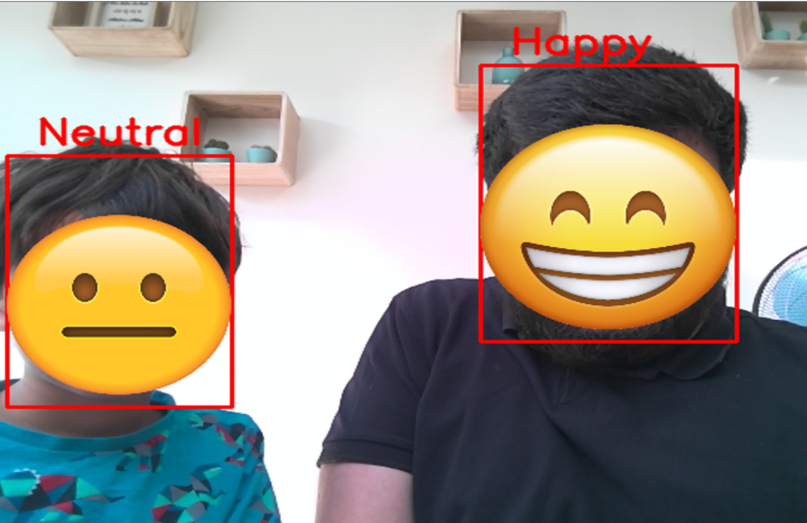

# Emotion detection using deep learning

  

## Introduction

  

This project aims to classify the emotion on a person's face into one of **height categories**, using deep convolutional neural networks. The model is trained on the **FER-2013** dataset (with **FER+** labels) which was published on International Conference on Machine Learning (ICML). This dataset consists of 35887 grayscale, 48x48 sized face images with **seven emotions** - angry, disgusted, fearful, happy, neutral, sad and surprised.**FER+** adds contemps as an additionnal emotion, upgrade the labels and remove bad pictures from the dataset.

  

## Dependencies

  

* Python 3, [OpenCV](https://opencv.org/), [Tensorflow](https://www.tensorflow.org/)

* To install the required packages, run `pip install -r requirements.txt`.

## Basic Usage

The repository is currently compatible with `tensorflow-2.0` and makes use of the Keras API using the `tensorflow.keras` library.

* First, clone the repository and enter the folder

```bash

git clone https://github.com/niyazaki/Emotion-detection.git

cd Emotion-detection

```

* If you want to view the predictions without training again, you can use the model available and run:

```bash

cd src

python display_emotion.py

```

| args | - |  default value | required |
|:--:|:--:|:--:|:--:|
| Model name | -n / --model_name | ferplusModel.h5 | |


 ## Generate Dataset and train Model

### Generate Dataset

1. Download the FER-2013 dataset from [official website](https://www.kaggle.com/c/challenges-in-representation-learning-facial-expression-recognition-challenge/data) and put it inside `FER` folder.
2. Download the [FER+ new labels](https://github.com/microsoft/FERPlus/blob/master/fer2013new.csv) inside `FER` folder
3. You have to convert the `fer2013.csv` file into images in folder named in respect with the new labels of `fer2013new.csv` using :

```bash

cd src

python generate_training_data.py -d data -fer FER/fer2013.csv -ferplus FER/fer2013new.csv

``` 

| args | - |  default value | required |
|:--:|:--:|:--:|:--:|
| Data folder | -d / --base_folder| | Yes |
| FER path | -fer / --fer_path| | Yes |
| FER+ path | -ferplus / --ferplus_path| | Yes |


* In FER+, labels are given as probability of being one or another emotion. Here we only take the maximum value and its corresponding emotion. In case of a tie, we take the most probable value (they're sorted from most probable to less probable from left to right)
* Here we only use Train and Test, so all the pictures in Valid can be put in the Test folder


### Train model

```bash

cd src

python create_model.py -n modelName.h5

```
| args | - |  default value | required |
|:--:|:--:|:--:|:--:|
| Model name | -n / --model_name | | Yes |
| Train path | -t / --train_dir| data/train |  |
| Test path | -v / --val_dir| data/test |  |
| Batch size |-b / --batch_size| 64 |  |
| Number of epoch |-e / --num_epoch| 30 |  |


This implementation by default detects emotions on all faces in the webcam feed. With a simple 4-layer CNN, the test accuracy reached ~75% in 30 epochs. 


  
## Algorithm

* First, the **haar cascade** method is used to detect faces in each frame of the webcam feed.

* The region of image containing the face is resized to **48x48** and is passed as input to the CNN. 

* The network outputs a list of **softmax scores** for the height classes of emotions.

* The emotion with maximum score is displayed on the screen.

## Example Output

  



  

## References

Atul Balaji in [GitHub - atulapra/Emotion-detection: Real-time Facial Emotion Detection using deep learning](https://github.com/atulapra/Emotion-detection/)  

"Challenges in Representation Learning: A report on three machine learning contests." I Goodfellow, D Erhan, PL Carrier, A Courville, M Mirza, B

Hamner, W Cukierski, Y Tang, DH Lee, Y Zhou, C Ramaiah, F Feng, R Li,

X Wang, D Athanasakis, J Shawe-Taylor, M Milakov, J Park, R Ionescu,

M Popescu, C Grozea, J Bergstra, J Xie, L Romaszko, B Xu, Z Chuang, and

Y. Bengio. arXiv 2013.